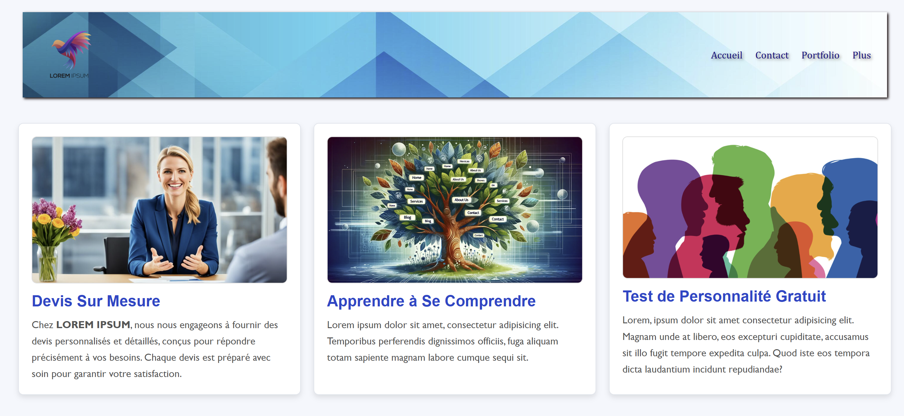
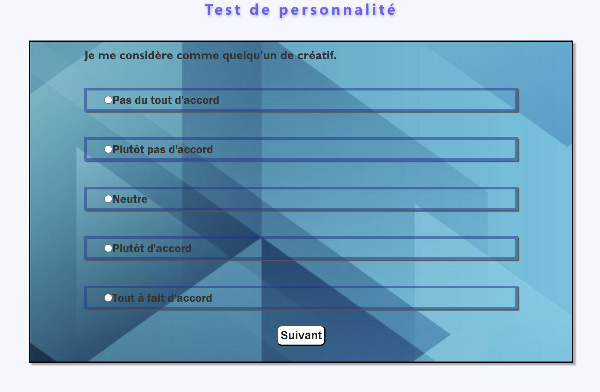

                                           Projet React : Test de Personnalité 
 

  
##  Description
Ce projet est mon deuxième projet en React, où j'ai pu approfondir ma compréhension de React et de ses possibilités, notamment en ce qui concerne les composants et la gestion de la logique. J'ai entrepris ce projet de manière autonome pour explorer davantage les composants React et la manière de structurer une application en simulant un JSON dans un fichier JSX. Le projet consiste en un test de personnalité simple qui fournit un résultat en fonction des réponses choisies par l'utilisateur. Bien que j'aie envisagé d'intégrer une API de test de personnalité, la plupart de ces API étant payantes, j'ai opté pour une solution maison.

##  Technologies utilisées
**React.js** : Pour la création de composants dynamiques et la gestion de l'état de l'application.

**Vite**: Pour la configuration rapide et légère de l'environnement de développement React.

**CSS3** : Pour styliser l'interface utilisateur et offrir une 
expérience utilisateur agréable.

## Caractéristiques principales 
Utilisation avancée des composants :
Le projet utilise plusieurs composants React pour structurer le test de personnalité de manière modulaire et réutilisable.

Simulation de données :
J'ai simulé un fichier JSON dans un composant JSX pour stocker les questions et les résultats du test. Cette approche m'a permis de comprendre comment gérer des données statiques et les manipuler en React.

 Logique de test de personnalité :
La logique du test évalue les réponses de l'utilisateur et affiche un résultat simple basé sur ses choix, démontrant la capacité de React à gérer les interactions utilisateur et à mettre à jour l'interface en temps réel.

Apprentissage et expérimentation :
Ce projet m'a permis de mieux comprendre la structure des composants, la gestion des états, et la manière dont React peut être utilisé pour construire des applications interactives et dynamiques.

Améliorations futures :
J'aimerais, à l'avenir, intégrer une API de test de personnalité plus complexe (si possible) pour enrichir l'expérience utilisateur et offrir des résultats plus variés et précis.

## Lien : 
[ICI](https://personality-test-git-master-maximes-projects-8b64083f.vercel.app/)

##  Installation & Utilisation
1. Cloner le dépôt :

```
git clone https://github.com/BertrandM22/Personality-Test.git
```

2. Installation des dépendances :
```
npm install
```
3. Lancer l'application :
```
npm run dev
```
4. Ouvrir dans le navigateur :
Accède à l'application en ouvrant l'URL fournie par Vite dans ton navigateur préféré.
